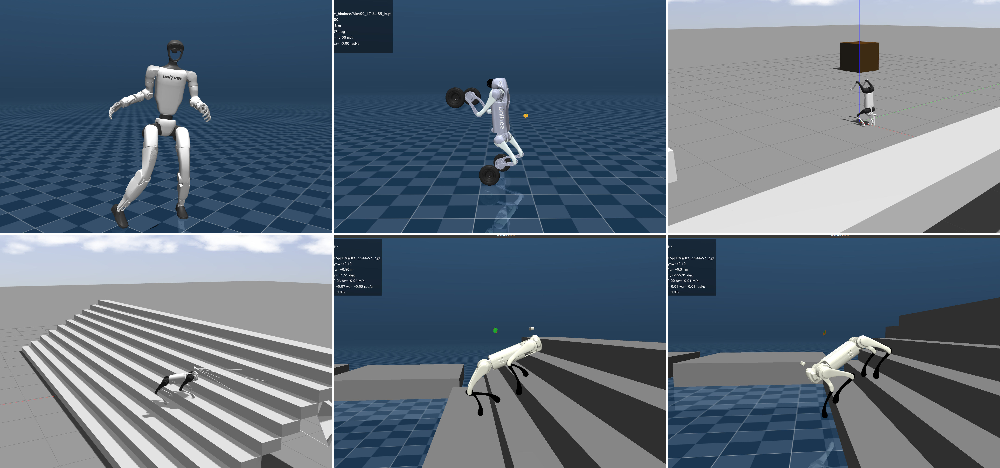
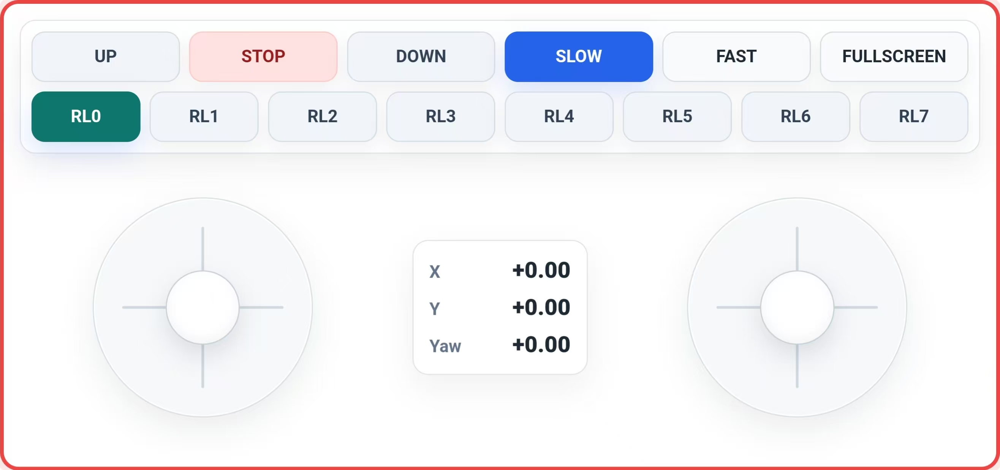

<div align="center">
  <h1 align="center">LeggedSkillDeploy</h1>
  <p align="center">
    <a href="README.md">🌎 English</a> | <span>🇨🇳 中文</span>
  </p>
</div>

<p align="center">
  
</p>

<p align="center">
  <strong>LeggedSkillDeploy</strong> 一个基于状态机的 Python 多策略部署框架。
</p>

<p align="center">
  <a href="https://www.bilibili.com/video/BV1cpGt65EF1/">
    
  </a>
  <a href="https://www.bilibili.com/video/BV1Ln3i6RE3c">
    
  </a>
</p>

## 支持机器人

- **四足机器人**：Go1、Go2
- **双轮足机器人**：Duow
- **四轮足机器人**：Go2W、M20
- **人形机器人**：G1（29 DoF）

具体策略及功能说明见 [Policy 说明](#3-policy-说明)。

---

## 1. 创建虚拟环境

使用以下命令创建并激活 conda 虚拟环境：

```bash
conda create -n lsd python=3.10
conda activate lsd
```

---

## 2. 快速开始

### 2.1 克隆 LeggedSkillDeploy

通过 Git 克隆仓库：

```bash
git clone https://github.com/haozhang04/LeggedSkillDeploy.git
```

### 2.2 安装依赖

进入项目目录并安装依赖。此过程可能需要一些时间：

```bash
cd LeggedSkillDeploy
pip install -r requirements.txt
```

### 2.3 运行仿真

#### 2.3.1 MuJoCo

```bash
python src/rl_mujoco.py
```

#### 2.3.2 MuJoCo GLFW

```bash
python src/rl_mujoco_glfw.py
```

#### 2.3.3 Gazebo

需要先编译 ROS 2 工作空间：

```bash
cd robot_description/urdf && colcon build && cd ../..
```

然后：

```bash
python src/rl_gazebo.py
```

---

## 3. Policy 说明

<table>
  <tr>
    <th>机器人</th>
    <th>Policy</th>
    <th>说明</th>
  </tr>
  <tr>
    <td rowspan="9">Go1 / Go2</td>
    <td><code>himloco</code></td>
    <td>HimLoco 算法</td>
  </tr>
  <tr>
    <td><code>np3o</code></td>
    <td>NP3O 算法</td>
  </tr>
  <tr>
    <td><code>moe</code></td>
    <td>MoE 算法</td>
  </tr>
  <tr>
    <td><code>go1</code></td>
    <td>包含 loco、handstand、leggedstand、hop、bound</td>
  </tr>
  <tr>
    <td><code>recoveryloco</code></td>
    <td>恢复行走</td>
  </tr>
  <tr>
    <td><code>go2_loco</code></td>
    <td>Go2 行走</td>
  </tr>
  <tr>
    <td><code>go2_back_filp</code></td>
    <td>后空翻</td>
  </tr>
  <tr>
    <td><code>go2_silde_filp</code></td>
    <td>侧空翻</td>
  </tr>
  <tr>
    <td><code>go2_jump</code></td>
    <td>跳跃</td>
  </tr>
  <tr>
    <td>Duow</td>
    <td><code>duow</code></td>
    <td>包含 loco</td>
  </tr>
  <tr>
    <td>Go2W</td>
    <td><code>go2w_himloco</code></td>
    <td>包含 loco、handstand、leggedstand</td>
  </tr>
  <tr>
    <td rowspan="2">M20</td>
    <td><code>M20</code></td>
    <td>包含 loco、highplatform、DreamWaQ</td>
  </tr>
  <tr>
    <td><code>M20_lab</code></td>
    <td>MoE 算法</td>
  </tr>
  <tr>
    <td rowspan="5">G1（29 DoF）</td>
    <td><code>g1_amp</code></td>
    <td>奔跑</td>
  </tr>
  <tr>
    <td><code>g1_loco</code></td>
    <td>稳定行走</td>
  </tr>
  <tr>
    <td><code>dance_102</code></td>
    <td>舞蹈</td>
  </tr>
  <tr>
    <td><code>gangnam_style</code></td>
    <td>江南 Style 舞蹈</td>
  </tr>
  <tr>
    <td><code>dance1_subject2</code></td>
    <td>查尔斯顿舞蹈</td>
  </tr>
</table>

---

## 4. 操作指南

### 4.1 键盘控制

| 按键 | 说明 |
|------|------|
| `W` / `S` | 前进 / 后退，调整 X 方向速度 |
| `A` / `D` | 左移 / 右移，调整 Y 方向速度 |
| `Q` / `E` | 左转 / 右转，调整偏航角速度 |
| `2` | 切换到 站立 |
| `3` | 切换到 趴下 |
| `4` | 切换到 RL 控制 |
| `空格` | 速度清零 |
| `Backspace` | 重置仿真 |
| `↑` / `↓` | 切换 RL 策略 |

### 4.2 Xbox 手柄控制

| 按键/摇杆 | 说明 |
|---------|------|
| `左摇杆` | 控制前后移动和左右平移 |
| `右摇杆` | 控制转向 |
| `X` | 切换到站立 |
| `B` | 切换到趴下 |
| `A` | RL 控制策略 1 |
| `Y` | RL 控制策略 2 |
| `LB` | RL 控制策略 3 |
| `RB` | RL 控制策略 4 |
| `DU` | RL 控制策略 5 |
| `DR` | RL 控制策略 6 |
| `DD` | RL 控制策略 7 |
| `DL` | RL 控制策略 8 |

### 4.3 手机 Web 控制

启动程序后，终端会输出手机控制页面地址，手机与电脑连接到同一网络后，在浏览器中打开该地址即可控制。

```bash
[PHONE] Web control: http://<电脑IP>:8080/
```

<p align="center">
  
</p>

---

## 5. 实机操作说明

> [!WARNING]
> 当前仅在 **Go1 Pro** 实机上完成测试。实机部署存在设备损坏风险，请在充分保护的条件下操作。

### 5.1 在 Go1 Pro 实机运行策略

- 使用网线连接 Go1 Pro 与电脑。
- Go1 Pro 机载电脑 IP 为 `192.168.123.161`；请将电脑 IP 设置为 `192.168.123.12`，子网掩码设置为 `255.255.255.0`。
- 确认可以正常连通：

```bash
ping 192.168.123.161
```

- 在遥控器上依次执行以下组合键，进入调试模式：

```bash
L2 + A
L2 + A
L2 + B
L1 + L2 + START
```

- 启动实机部署程序：

```bash
python src/rl_real_go1.py
```

### 5.2 适配你的机器人

- 修改 `src/interface/IOReal_go1.py`，完成对应机器人的接口适配。

---

## 🙏 致谢

本项目基于以下开源项目开发，感谢原作者的贡献：

| 项目 | 仓库链接 |
|------|----------|
| **RL_SAR** | [](https://github.com/fan-ziqi/rl_sar.git) |
| **HIMLoco** | [](https://github.com/InternRobotics/HIMLoco.git) |
| **NP3O** | [](https://github.com/zeonsunlightyu/LocomotionWithNP3O.git) |
| **MoE** | [](https://github.com/wty-yy/go2_rl_gym) |
| **unitree_rl_lab** | [](https://github.com/unitreerobotics/unitree_rl_lab.git) |

**如果这个项目对你有帮助，请给我点个 Star ⭐！**
